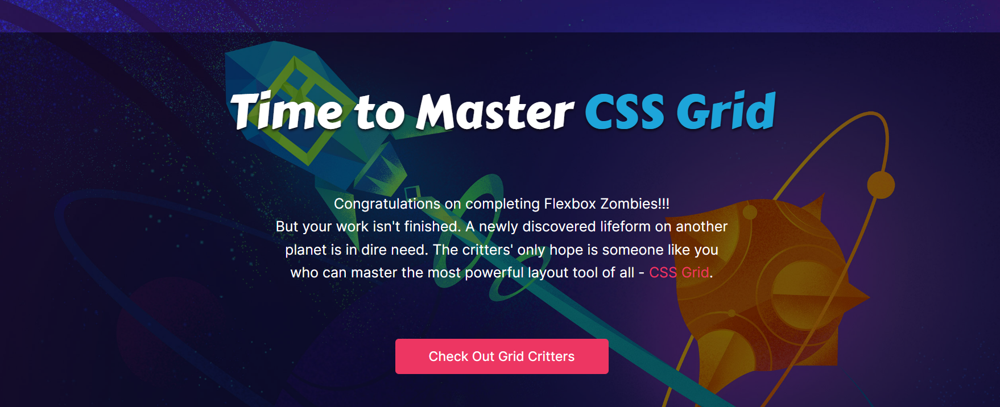

# Flexbox Zombies

## Chapter-1:
### Options used:
flex-direction:row (to point horizontally, ie EAST)
flex-direction: row-reverse (to point horizontally in reverse direction, ie WEST)
flex-direction: column (for pointing SOUTH)
flex-direction: column-reverse (for pointing NORTH)

## Chapter-2:
### Options used:
display:flex (to activate flexbox)
justify-content: flex-end (to align at horizontal end of flexbox)
(End implies farther from where main axis starts, which is different for different flex-directions)
(Like for flex-direction: column, aligns at vertical end of container and so on)

justify-content: center (for aligining to center)

justify-content: space-between (for equal space between elements but not at extreme ends)

justify-content: space-around (space between elements including extreme ends, but less at ends than between)

Tutorial part over, it's show time:

### 2.12 : 
flex-direction: row-reverse;
justify-content:flex-end;
(Aiming at end of flexbox while pointing west)

### 2.13:
flex-direction: column;
justify-content: center;
(Aiming at center of flexbox while pointing south)

### 2.14:
flex-direction: column-reverse;
(Aiming at beginning of flexbox while pointing north)

### 2.15:
flex-direction: column-reverse;
justify-content:space-between;
(Aiming at beginning of flexbox while pointing north with space only in between)

### 2.16:
flex-direction: column-reverse;
justify-content:center;
(Aiming at center of flexbox while pointing north)

### 2.17:
flex-direction:row-reverse;
justify-content:space-around;
(Aiming in west with space between elements including extreme ends, but less at ends than between)

Just realised, the levels are too many to add explanations for each of 'em, so just gonna add the codes now till the time they remain elementary.

### 2.18:
display: flex;
flex-direction:  column;
justify-content: flex-end;

### 2.19:
display: flex;
flex-direction:  row;
justify-content: center;

### 2.20:
display: flex;
flex-direction:  row-reverse;
justify-content: center;

## Chapter-3:
### 3.3:
align-items: flex-start;
(always perpendicular to justify-content, actual direction depends on flex-direction)
(like here it implies vertical alignment, top to bottom)

### 3.4:
flex-direction: column-reverse;
align-items: flex-start;
(always perpendicular to justify-content, actual direction depends on flex-direction)
(like here it implies horizontal alignment, left to right)

### 3.5:
align-items: flex-end;

### 3.6:
flex-direction: column;
align-items: flex-end;

### 3.7:
align-items:stretch;

### 3.8:
align-items: center;

### 3.10:
flex-direction: column-reverse;
  justify-content:flex-end;
  align-items:flex-end;

### 3.11:
flex-direction: row-reverse;
justify-content: space-between;
align-items: flex-start

### 3.12:
flex-direction: column;
justify-content: center;
align-items: center

### 3.13:
flex-direction: row-reverse;
justify-content: flex-end;
align-items: flex-end;

### 3.14:
flex-direction: column;
justify-content:space-around;
align-items: flex-start;

### 3.15:
flex-direction: column-reverse;
justify-content:flex-end;
align-items: flex-start;

### 3.16:
justify-content:center;
align-items: flex-start;

### 3.17:
justify-content:space-around;
align-items: flex-end;

### 3.18:
justify-content:space-between;
align-items: stretch;

### 3.19:
display:flex;
(coz everything else is default)

### 3.20:
flex-direction: row-reverse;
justify-content:flex-end;
align-items: center;

## Chapter-4:
### 4.3:
justify-content:flex-end;
align-items: center;

### 4.4:
```
crossbow {
  display: flex;
  justify-content: flex-end;
  align-items: center;
}

.target:nth-of-type(2) {
  align-self:flex-start;
}
```
(have all others be aligned center vertically except the second which is aligned at top vertically)

### 4.5:
```
.target:nth-of-type(1) {
  align-self:stretch;
}
```

### 4.6:
```
crossbow {
  display: flex;
  align-items: flex-start;
  flex-direction:row-reverse;
}

.target:nth-of-type(1) {
  align-self: center;
}
```
(due to row-reverse, the rightmost is actually no 1)

### 4.7:
```
.target.male {
  align-self:flex-end;
}
```
### 4.8:
```
.target:nth-of-type(2) {
  align-self:flex-end;
}
```
### 4.10:
```
crossbow {
  display:flex;
  justify-content:flex-end;
  align-items:flex-start;
}

.target:nth-of-type(2) {
  align-self:stretch;
  
}
```
### 4.11:
```
crossbow {
  display:flex;
  justify-content:space-between;
  align-items:flex-end;
}

.target:nth-of-type(2) {
  align-self:flex-start;
}
```
### 4.12:
```
crossbow {
    display:flex;
    flex-direction:column-reverse;
  align-items:flex-end;
}

.target.female {
  align-self:center;
}
```
### 4.13:
```
crossbow {
  display:flex;
  justify-content:space-around;
  
}

.target:nth-of-type(3) {
  align-self:flex-start;
  
}
```
### 4.14:
```
crossbow {
  display:flex;
  flex-direction:row-reverse;
  justify-content:center;
  align-items:center;
  
}

.target:nth-of-type(3) {
  align-self:flex-end;
  
}
```
### 4.15:
```
crossbow {
  display:flex;
  flex-direction:column-reverse;
  justify-content:space-between;
  align-items:center;
  
}

.target:nth-of-type(2) {
  align-self:flex-end;
  
}
```
### 4.16:
```
crossbow {
  display:flex;
  flex-direction:row-reverse;
  justify-content:flex-end;
  align-items:flex-end;
  
}

.target:nth-of-type(3) {
  align-self:flex-start;
  
}
```
### 4.17:
```
crossbow {
   display:flex;
  justify-content:center;
  align-items:center;
}
.target.female {
  align-self:flex-start;

}
```

*Backticks seem fun but are tiring, so no more backticks*

## Chapter-5:
### 5.5:
display:flex;
  justify-content:center;
  align-items:center;

### 5.6:
  crossbow {
  display: flex;
  justify-content: center;
  align-items: center;
}

.target.goo {
  flex-grow:1;
}

### 5.7:
flex-grow:1;
(flex-grow makes stuff grow vertically if we're aiming north or south)

### 5.8:
.target:nth-of-type(1) {
    flex-grow:1;
}

.target:nth-of-type(2) {
  flex-grow:2;
  
}
(bcoz the second one grew at **twice the rate** as first one)

### 5.9:
.target:nth-of-type(1) {
  flex-grow: 3;
}

.target:nth-of-type(2) {
  flex-grow: 1;
}

### 5.10:
crossbow {
  display: flex;
  justify-content: center;
  align-items: center;
}

.target{
  flex-grow:1;
}

.target:nth-of-type(2) {
  flex-grow:0;
}
(flex-grow always acts on flex items and can be overriden if needed)

### 5.12:
crossbow {
  display: flex;
}

.target.goo {
  flex-grow:1;
  align-self:flex-end;
  
}

.target.female {
  align-self:flex-start;
}

### 5.13:
crossbow {
  display: flex;
  flex-direction:column;

}

.target:nth-of-type(1) {
}

.target:nth-of-type(2) {
  align-self:flex-end;
  flex-grow:1
  
}

### 5.14:
crossbow {
  display:flex;
  flex-direction:row-reverse;
  align-items:center;
}

.target.goo {
  flex-grow:1;
}

.target:nth-of-type(1) {
  flex-grow:2;
  align-self:flex-end;
  
}

### 5.15:
crossbow {
  display:flex;
  flex-direction:column-reverse;
  align-items:flex-start;
}

.target:nth-of-type(3) {
  flex-grow:1;
}

### 5.16:
crossbow {
  display:flex;
  align-items:flex-start;
}

.target.goo {
  flex-grow:1;
  align-self:stretch;
}

### 5.17:
crossbow {
  display:flex;
  flex-direction:row-reverse;
  align-items:flex-start;
}

.target.goo {
  flex-grow:1;
}

.target:nth-of-type(1) {
  flex-grow:0;
}

.target:nth-of-type(4) {
  flex-grow:3;
}

### 5.18:
crossbow {
  display:flex;
  flex-direction:column-reverse;
  align-items:center;
}

.target.goo {
  flex-grow:1;
}

.target:nth-of-type(2) {
  align-self:stretch;
}

.target:nth-of-type(3) {
  flex-grow:0;
}

### 5.19:
crossbow {
  display:flex;
  align-items:flex-end;
}

.target.goo {
 flex-grow:1;
 align-self:flex-start;
}

.target:nth-of-type(3) {
 align-self:stretch 
}

### 5.20:
crossbow {
  display:flex;
  flex-direction:row-reverse;
  align-items:flex-end;
}

.target.goo {
  flex-grow:1;
}

.target:nth-of-type(4) {
  flex-grow:3;
}

### 5.21:
crossbow {
  display:flex;
  flex-direction:column;
  align-items:flex-end;
}

.target:nth-of-type(2) {
  flex-grow:1;
  align-self:stretch;
}

## Chapter-6:
### 6.3:
.target.goo {
  flex-shrink:1;
}

### 6.4:
.target.goo {
  flex-shrink:2;
}

### 6.5:
.target:nth-of-type(2), .target:nth-of-type(3) {
  flex-shrink:2;
}

### 6.6:
.target:nth-of-type(3) {
  flex-shrink:3
}

### 6.7:
.target:nth-of-type(3) {
  flex-shrink:0;
}

### 6.8:
.target.goo {
  flex-grow:1;
}

### 6.10:
crossbow {
  display:flex;
  align-items:flex-start;
}

.target.goo {
  flex-grow:1;
}

.target.male {
  align-self:center;
}

### 6.11:
crossbow {
  display:flex;
  flex-direction:column;
  align-items:center;
}

.target:nth-of-type(2) {
  align-self:stretch;
}

.target:nth-of-type(3) {
  flex-shrink:0;
  flex-grow:1;
}

### 6.12:
crossbow {
  display:flex;
  flex-direction:row-reverse;
  align-items:flex-start; 
}

.target:nth-of-type(1) {
  align-self: center;
}

.target:nth-of-type(2) {
  flex-shrink:0;
  align-self:center;
  flex-grow:1;
}

### 6.13:
crossbow {
  display:flex;
  flex-direction:column-reverse;
  align-items:flex-start;
}

.target:nth-of-type(3) {
  flex-grow:1;
  flex-shrink:0;
}

### 6.14:
crossbow {
  display:flex;
  align-items:flex-start;
}

.target:nth-of-type(2) {
  flex-grow:2;
}

### 6.15:
crossbow {
  display:flex;
  flex-direction:column;
  align-items:center;
}

.target:nth-of-type(1) {
  flex-shrink:2;
  
}

.target:nth-of-type(2) {
  flex-shrink:0;
  flex-grow:1;
}

### 6.16:
crossbow {
  display:flex;
  flex-direction:column-reverse;

}

.target.goo {
  flex-grow:1; 
}

.target:nth-of-type(1) {
  align-self:flex-end;
}

.target:nth-of-type(2) {
  flex-shrink:2;
}

.target:nth-of-type(3) {
  align-self:flex-start;
  flex-grow:2;
}

### 6.17:
crossbow {
  display:flex;
  align-items:flex-end;
}

.target.goo {
  align-self:flex-start;
  flex-grow:1;
}

.target:nth-of-type(1) {
  flex-shrink:0;
  flex-grow:3;
}

.target:nth-of-type(3) {
  align-self:stretch;
  flex-shrink:2;
  flex-grow:1;
}

### 6.18:
crossbow {
  display:flex;
  flex-direction:row-reverse;
  align-items:flex-end;
}

.target:nth-of-type(2) {
  align-self:stretch;
  flex-shrink:2;
  flex-grow:2;
}

.target:nth-of-type(3) {
  flex-shrink:0;
  flex-grow:1;
  align-self:flex-start;
}

### 6.19:
crossbow {
   display:flex;
  flex-direction:column;

}
.target:nth-of-type(1) {
  flex-shrink:0;
}

.target:nth-of-type(2) {
  flex-grow:1;
}

.target:nth-of-type(3) {
  align-self:flex-end;
}

## Chapter 7:
### 7.3:
flex-basis:300px;
(flex-basis is kind of a new and improved version of width)

### 7.4:
flex-basis:100px;
(flex-basis dominates any width setting)

### 7.5:
min-width:300px;
(min-width is like lower limit of flex-basis)

### 7.6:
max-width:100px;

### 7.7:
flex-basis:300px;
(flex-basis acts along main axis always, so horizontally for width and vertically for height)

### 7.8:
flex-basis:50%;

### 7.9:
flex-basis:300px;
(it's like a starting point, an ideal size when no shrinking or growing)

### 7.10:
flex-basis:auto , implies, no flex-basis set and width setting is taken by default

### 7.11:
flex-shrink:2;

### 7.12:
flex-grow:1;

### 7.14:
crossbow {
  display:flex;
  flex-direction:row-reverse;
  align-items:flex-start;
  justify-content:flex-end;
}

.target.goo {
  flex-basis:300px;
}

### 7.15:
crossbow {
  display:flex;
  flex-direction:column;
  align-items:flex-end;
  justify-content:center;
}

.target.goo {
  flex-basis:75px;
}

### 7.16:
crossbow {
  display:flex;
  flex-direction:column-reverse;
  align-items:center;
  justify-content:flex-start;
}

.target.goo {
    flex-basis:500px;
}

### 7.17:
crossbow {
  display:flex;
  align-items:center;
  
}

.target.goo {
    flex-basis:50%;
}

.target:nth-of-type(3) {
  align-self:stretch;
}

### 7.18:
crossbow {
  display:flex;
  align-items:flex-end;  
}

.target.goo {
  align-self:center;
  flex-grow:1
}

.target:nth-of-type(3) {
  align-self:flex-start;
  flex-basis:75px;
  flex-grow:0
}

### 7.19:
crossbow {
  display:flex;
  flex-direction:column-reverse;
  align-items:center;
}

.target.goo {
  flex-grow:1;
}

.target:nth-of-type(2) {
  max-height:200px;
}
(max-height bcoz main axis is vertical)

### 7.20:
crossbow {
  display:flex;
  align-items:center;
  justify-content:center;
}

.target.goo {
  flex-shrink:1; 
  flex-basis:200px;
}

.target:nth-of-type(1) {
  flex-shrink:0;
}

.target:nth-of-type(2) {
  min-width:300px;
}

### 7.21:
crossbow {
  display:flex;
  flex-direction:column;
  align-items:flex-start;
}

.target.goo {
  flex-basis:250px;
}

.target:nth-of-type(1) {
  flex-shrink:0;
}

### 7.22:
crossbow {
  display:flex;
  justify-content:flex-end;
  align-items:center;
}

.target.goo {
  flex-basis:200px;
}

.target:nth-of-type(2) {
  flex-shrink:0;
}

### 7.23:
crossbow {
  display:flex;
}

.target.goo {
  flex-basis:0;
  flex-grow:1;
}

.target:nth-of-type(3) {
  align-self:flex-start;
}

## Chapter 8:
### 8.3:
order:2;
(lower order displayed closer)

### 8.4:
order:2;

### 8.5:
order:1;

### 8.6:
order:1;

### 8.7:
order:-1;

### 8.8:
.target.female {
  order:1;
}

.target.goo {
  order:2;
}

.target.male {
  order:3;
}

### 8.10:
crossbow {
  display:flex;
  justify-content:flex-end;
  align-items:flex-start;
}

.target.goo {
  order:-1;
  flex-grow:1;
  align-self:stretch;
} 

### 8.11:
crossbow {
  display:flex;
  flex-direction:row-reverse;
  align-items:flex-start;
  justify-content:center;
}

.target.goo {
  order:1;
  flex-basis:350px;
  align-self:flex-end;
} 

### 8.12:
crossbow {
  display:flex;
  flex-direction:column-reverse;
  align-items:center;
}

.target.goo {
  order:-1;
  align-self:stretch;
} 

### 8.13:
crossbow {
  display:flex;
  flex-direction:column;
  align-items:flex-end;
    
}

.target.goo {
  flex-grow:1;
  order:1;
  align-self:stretch;
  flex-basis:75px;
}

### 8.14:
crossbow {
  display:flex;
  align-items:center;
  justify-content:space-around;
}

.target.female {
  order:2
}
  
.target.goo {
  order:3;
  
}

.target.male {
  order:1;
}

### 8.15:
crossbow {
  display:flex;
  align-items:center;
}

.target.goo {
  order:2;
  flex-grow:1;
}
  
.target.male {
  order:1;
}

### 8.16:
crossbow {
  display:flex;
  align-items:flex-start;
}

.target.female {
  order:-1;
}
  
.target:nth-of-type(1) {
  align-self:flex-end;
  flex-grow:1;
  flex-shrink:0;
}
(order has no effect on nth of type numbering)

## Chapter-9:
### 9.3:
flex-wrap:wrap;

### 9.4:
flex-wrap:wrap;

### 9.5:
flex-wrap:wrap;

### 9.6:
 align-items: flex-end;
  flex-wrap:wrap-reverse;
  (wrap-reverse reverses sense of align-items)

### 9.7:
crossbow {
  display: flex;
  align-items: center;
  flex-wrap:wrap;
}

.target.goo {
  flex-grow:1;
}

### 9.8:
flex-wrap:wrap;
(wrap first, shrink second)

### 9.9:
justify-content: flex-end;
  flex-wrap:wrap;

### 9.11:
crossbow {
  display:flex;
  flex-direction:row-reverse;
  flex-wrap:wrap;
  align-items: flex-start;
}

### 9.12:
crossbow {
  display:flex;
  flex-direction:column-reverse;
  align-items:center;
  flex-wrap:wrap;
}

### 9.13:
crossbow {
  display:flex;
  align-items:flex-start;
  flex-wrap:wrap;
}

.target:nth-of-type(2) {
  align-self:flex-end;
}

### 9.14:
crossbow {
  display: flex;
  align-items: center;
  flex-wrap:wrap;
}

.target.goo {
  flex-basis:50%;
}

### 9.15:
crossbow {
  display:flex;
  flex-direction:column;
  align-items:center;
  justify-content:center;
  flex-wrap:wrap;
}

### 9.16:
crossbow {
  display:flex;
  flex-direction:column-reverse;
  align-items:flex-end;
  flex-wrap:wrap-reverse;
}
(flex-start wala effect flex-end se aayega coz wrap reverse)

### 9.17:
crossbow {
  display:flex;
  align-items:flex-start;
  flex-wrap:wrap;
  justify-content:center;
}

.target:nth-of-type(2) {
  flex-grow:1;
}

### 9.18:
crossbow {
  display:flex;
  align-items:flex-start;
  flex-wrap:wrap;
  justify-content:center;
}

.target:nth-of-type(2) {
  flex-grow:1;
}

.target:nth-of-type(3) {
  flex-grow:1;
}

## Chapter-10:
### 10.3:
flex-wrap:wrap;
(align-content is similar to align-items but it aligns wrapped lines, how the lines align with each other, has no effect if there's only single line)

### 10.4:
align-content:flex-start;

### 10.5:
align-content:flex-end;

### 10.6:
align-content:flex-end;
(like align-items, align-content's direction depends on flex-direction)

### 10.7:
align-content:center;

### 10.8:
align-content:space-around;

### 10.9:
align-content:space-between;

### 10.11:
crossbow {
  display:flex;
  flex-direction:row-reverse;
  flex-wrap:wrap;
  align-items:flex-start;
  align-content:center;
}

### 10.12:
crossbow {
  display:flex;
  flex-wrap:wrap;
  align-items:flex-end;
  align-content:flex-end;
}

### 10.13:
crossbow {
  display:flex;
  flex-wrap:wrap;
  align-items:center;
  align-content:space-between;
}

.target:nth-of-type(2) {
  flex-grow:1;
}

### 10.14:
 crossbow {
  display:flex;
  flex-direction:column-reverse;
  flex-wrap:wrap;
  justify-content:center;
  align-items:flex-end;
}

### 10.15:
crossbow {
  display:flex;
  flex-wrap:wrap;
  align-content:flex-start;
  align-items:flex-end;
}

### 10.16:
crossbow {
  display:flex;
  flex-wrap:wrap;
  align-content:center;
  align-items:flex-end;
  justify-content:flex-end;
}

.target:nth-of-type(3) {
  flex-grow:1;
}

## Chapter-11:
### 11.3:
flex:1 1 300px;
(shorthand for flex-grow,flex-shrink,flex-basis - gsb)

### 11.4:
flex: 1 0 auto;
(default of flex-basis in this shorthand is 0px)

### 11.5:
flex: 0 300px;
(no 2nd parameter implies flex-shrink:1)

### 11.6:
flex:1;
(need to set atleast flex-grow)

### 11.7:
flex:auto;
(grow - 1, shrink - 1, basis - auto)

### 11.8:
flex:none;
(grow - 0, shrink - 0, basis - auto)

### 11.9:
flex-flow:column wrap;

### 11.11:
crossbow {
  display:flex;
  flex-flow:row-reverse;
  justify-content:flex-end;
  align-items:flex-start;
}

.target.goo {
  flex:0 300px;
}

### 11.12:
crossbow {
  display:flex;
  justify-content:center;
  align-items:center;
}

.target:nth-of-type(1) {
  flex:none;
}

### 11.13:
crossbow {
  display:flex;
  align-items:center;
}

.target.goo {
  flex: 0 0 25%;
}

.target:nth-of-type(3) {
  align-self:stretch;
}

### 11.14:
crossbow {
  display:flex;
  flex-flow:column-reverse;
  justify-content:flex-end;
  align-items:flex-end;
}

.target:nth-of-type(3) {
  flex:auto;
}

### 11.15:
crossbow {
  display:flex;
  flex-flow:row-reverse wrap;
  align-items:flex-start;
  align-content:center;
}

## Chapter-12:
### 12.3:
crossbow {
  display:flex;
  flex-flow:row-reverse;
  justify-content:center;
  align-items:center;
}

### 12.4:
crossbow {
  display:flex;
  align-items:flex-end;
}

.target.goo {
  flex-grow:1;
  align-self:stretch;
}

### 12.5:
crossbow {
  display:flex;
  flex-flow:column-reverse;
  justify-content:flex-end;
  align-items:flex-end;
}

.target.female {
    align-self:center;
}

### 12.6:
crossbow { 
  display:flex;
  flex-flow:row-reverse;
  justify-content:flex-end;
  align-items:flex-end;
}

.target:nth-of-type(3) {
  align-self:flex-start;
}

### 12.7:
crossbow {
  display:flex;
  flex-flow:wrap;
  align-items:flex-start; 
}

.target:nth-of-type(2) {
  flex-grow:1;
}

### 12.8:
crossbow {
  display:flex;
  flex-flow:wrap;
  align-items:flex-end; 
}
.target:nth-of-type(2) {
  flex-grow:1;
}

### 12.9:
crossbow {
  display:flex;
  flex-flow:column;
  justify-content:flex-end;
  align-items:center;
}

.target:nth-of-type(2) {
    align-self:stretch;
}

.target:nth-of-type(3) {
  flex-grow:1;
  flex-shrink:0;
}

### 12.10:
crossbow {
  display:flex;
  flex-flow:row-reverse;
  justify-content:flex-end;
  align-items:flex-end;
}

.target:nth-of-type(2) {
  align-self:stretch;
  flex-grow:1;
  flex-shrink:2;
}

.target:nth-of-type(3) {
  align-self:flex-start;
}

.target:nth-of-type(4) {
  
}

### 12.11:
crossbow {
  display:flex;
  justify-content:space-around;
  align-items:center;
}

.target.dave {
  order:1;
  align-self:flex-start;
}
  
.target.goo {
  align-self:flex-end;
}



### Cheers!