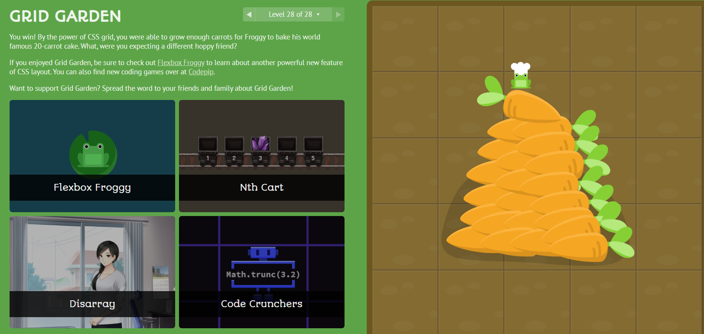

# Grid Garden

## Level-1:
```
grid-column-start:3;
```
(so that cell starts from 3rd vertical line)

## Level-2:
```
grid-column-start:5;
```
(so that cell starts from 5th vertical line)

## Level-3:
```
grid-column-end:4;
```
(so that cell ends at 4th vertical line)

## Level-4:
```
grid-column-end:2;
```
(end value can be smaller than start)

## Level-5:
```
grid-column-end:-2;
```
(end at 2nd from right)

## Level-6:
```
grid-column-start:-3;
```
(start at 3rd from right)

## Level-7:
```
grid-column-end: span 2;
```
(span width of 2 cells)

## Level-8:
```
grid-column-end: span 5;
```
(span width of 5 cells)

## Level-9:
```
grid-column-start: span 3;
```
(span width of 3 cells)

## Level-10:
```
grid-column: 4/6;
```

## Level-11:
```
grid-column : 2/span 3
```

## Level-12:
```
grid-row-start:3;
```

## Level-13:
```
grid-row:3/span 3
```

## Level-14:
```
grid-column: 2/3;
grid-row: 5/6;
```

## Level-15:
```
grid-column:2/span 4;
grid-row:1/span 5;
```

## Level-16:
```
grid-area:1/2/4/6;
```

## Level-17:
```
grid-area:2/3/5/6;
```

## Level-18:
```
order:1
```

## Level-19:
```
order:-1
```

## Level-20:
```
grid-template-columns:50%
```
(have the columns take 50% of grid space)

## Level-21:
```
grid-template-columns:repeat(8,12.5%);
```

## Level-22:
```
grid-template-columns: 100px 3em 40%;
```

## Level-23:
```
grid-template-columns: 1fr 5fr;
```
(to divide into 1/6th and 5/6th)

## Level-24:
```
grid-template-columns: 50px repeat(3,1fr) 50px;
```
(50px column, then 3 1/3rds then 50px)

## Level-25:
```
grid-template-columns: 75px 3fr 2fr;
```

## Level-26:
```
grid-template-rows: repeat(4,12.5px) 1fr;
```
(spare 50px at top and split it into 4 rows, and have 5th row to cover rest of the space)

## Level-27:
```
grid-template: 60% 40% / 200px;
```
(two rows, one taking up 60% another 40%. First column taking up 200px)

## Level-28:
```
grid-template: 1fr 50px / 20% 80%;
```
(we need two rows, second 50px wide and other taking up rest of space. We also need two columns, first taking 20% and the other taking 80%)



### Cheers!